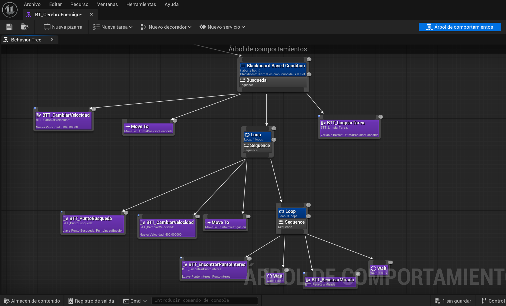
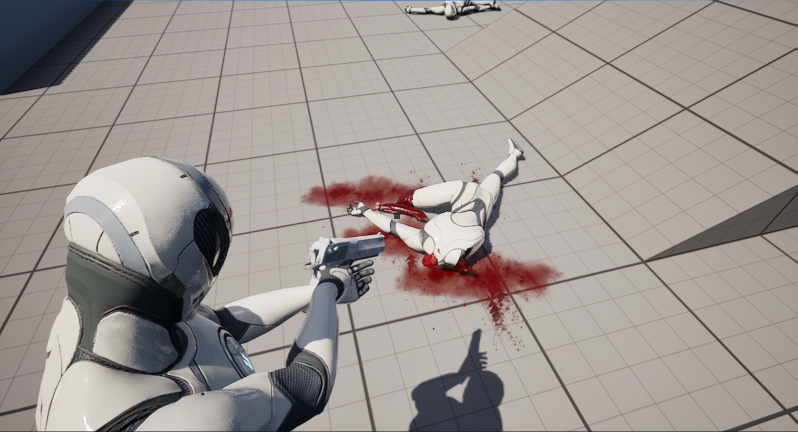
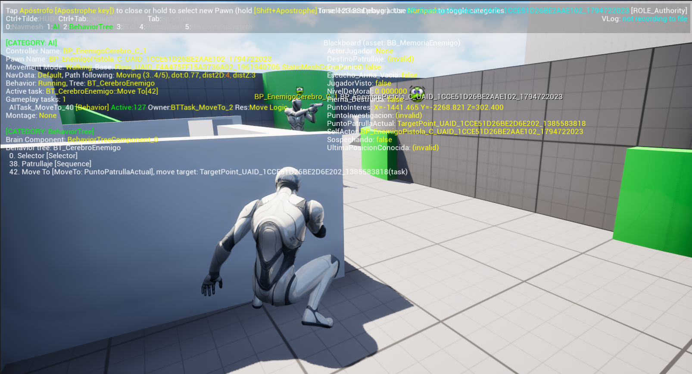
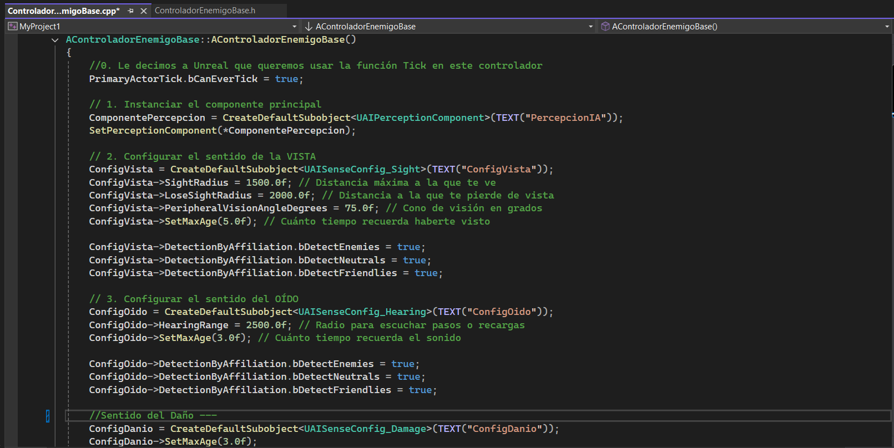

# Demo Técnica UE5: Inteligencia Artificial Táctica y Mecánicas Shooter

Proyecto de desarrollo progresivo en Unreal Engine 5 enfocado en la construcción de sistemas robustos de Inteligencia Artificial, balística matemática y físicas reactivas. Desarrollado bajo principios SOLID, el proyecto aísla deliberadamente las mecánicas base (C++ y Blueprints) de la estética visual para garantizar rendimiento y escalabilidad.

---

## Contexto y reto de desarrollo

El objetivo fue construir un entorno de simulación táctica (graybox) superando las lógicas prefabricadas del motor. El reto principal consistió en desarrollar una IA capaz de percibir, recordar y flanquear al jugador de forma orgánica, acoplada a un sistema de combate donde las físicas de impacto y la movilidad respondan a cálculos matemáticos precisos en lugar de animaciones lineales estáticas.

**Solución:** una arquitectura modular dividida en tres pilares: un jugador con mecánicas procedurales (Aim Sway, Parkour), un motor físico dinámico impulsado por Chaos (desmembramientos y ragdolls optimizados), y un "cerebro híbrido" para los NPCs donde C++ procesa los estímulos sensoriales y los Behavior Trees (Blueprints) ejecutan la toma de decisiones.

---

## Stack tecnológico

- **Motor gráfico:** Unreal Engine 5
- **Lógica backend:** C++ (AI Controllers, UAIPerceptionComponent nativo)
- **Visual scripting:** Blueprints (Behavior Trees, Blackboards, AnimGraphs)
- **Físicas y destrucción:** Chaos Physics Engine (ragdolls, desmembramiento paramétrico)
- **Efectos visuales (VFX):** Niagara Systems, DBuffer Decals
- **Herramientas de entorno:** NavMesh, Megascans (Quixel)

---

## Decisiones arquitectónicas clave

### Arquitectura híbrida de IA (C++ / BP)
El procesamiento sensorial (visión de cono, audición y validación de línea de visión) se codificó en C++ nativo (`ControladorEnemigoBase`). Los resultados se inyectan en tiempo real al Blackboard, delegando la lógica de navegación (patrullaje, búsqueda, pánico, combate) a un Behavior Tree modular e instanciado.

### Balística matemática y Aim Sway procedural
Se descartaron los proyectiles físicos dependientes del Tick a favor de un sistema de Line Trace asíncrono. El balanceo del arma y la cámara se calcula en tiempo real mediante funciones trigonométricas en el espacio óseo, eliminando CameraShakes genéricos y manteniendo la precisión geométrica al apuntar.

### Sistema gore data-driven (Chaos)
La mutilación y reacción de impacto operan independientemente de la vida global del NPC. Un diccionario de datos (Map) ensambla dinámicamente extremidades mutiladas en tiempo real. Para proteger la CPU, se implementó una rutina de suspensión post-mortem que fuerza al motor Chaos a poner en estado Sleep a los Rigid Bodies tras 4 segundos.

### Locomoción desacoplada y cobertura dinámica
La máquina de estados manipula la cápsula de colisión (`Crouch`/`Uncrouch`) basándose en Raycasting espacial, permitiendo transiciones orgánicas de cobertura (pop-up from cover) y sistemas de vaulting/mantle sin romper las físicas del motor mediante animaciones pre-calculadas.

---

## Módulos principales

| Módulo | Responsabilidad |
|--------|-----------------|
| Núcleo de percepción (C++) | Diferenciación entre visión periférica y frontal, memoria a corto plazo (última posición conocida) y filtrado de estímulos por tags. |
| Gunplay y armamento | Herencia de clases (`BP_ArmaBase`), cadencia bloqueada matemáticamente y recargas asíncronas libres de condiciones de carrera. |
| Feedback volumétrico | Proyección geométrica de sangre mediante Decals confinados a canales específicos (`Sangre_Entorno`) para evitar Z-Fighting y proyecciones sobre entidades móviles. |
| Comportamiento táctico | Sistema de tracking asíncrono mediante `Set Focal Point`, permitiendo strafe lateral y barrido visual durante las fases de patrullaje. |

---

## Capturas

| Behavior Tree | Sistema físico y desmembramiento |
|:---:|:---:|
|  |  |

| Percepción y debugging | AI Controller (C++) |
|:---:|:---:|
|  |  |

---

## Estado del proyecto

- **Versión:** Fase A completada
- **Estado:** demo técnica funcional (graybox)
- **Fases completadas:** Fase 1 (jugador y matemáticas), Fase 2 (físicas y game feel), Fase 3 (IA - Módulo A)
- **Próxima fase:** Fase B (EQS y coberturas dinámicas)
- **Documentación:** +30 páginas de bitácora técnica

---

## Instalación local

```bash
# 1. Clonar el repositorio
git clone https://github.com/Alej673/MyProject1.git
cd MyProject1

# 2. Generar archivos de proyecto de Visual Studio
# Clic derecho en 'MyProject1.uproject' -> "Generate Visual Studio project files"

# 3. Compilar solución
# Abrir 'MyProject1.sln' en Visual Studio 2022 y compilar (Development Editor / Win64)

# 4. Abrir el proyecto en Unreal Engine 5.x
# Doble clic en 'MyProject1.uproject'
```

---

## Enlaces

- [Repositorio](URL)
- [Video demo](URL) *(próximamente)*

---

**Autor:** Alejandro Larco  
[GitHub](URL) · [LinkedIn](URL) · [Portafolio](URL)
